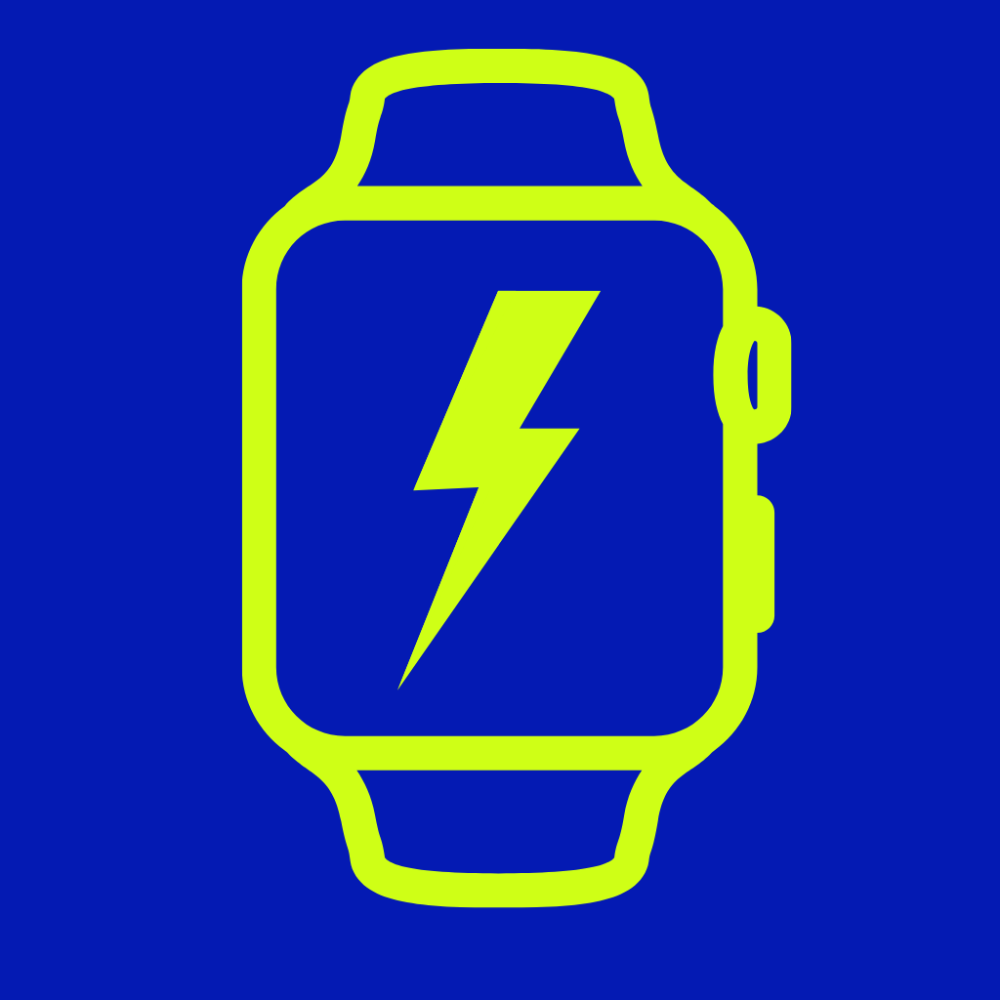
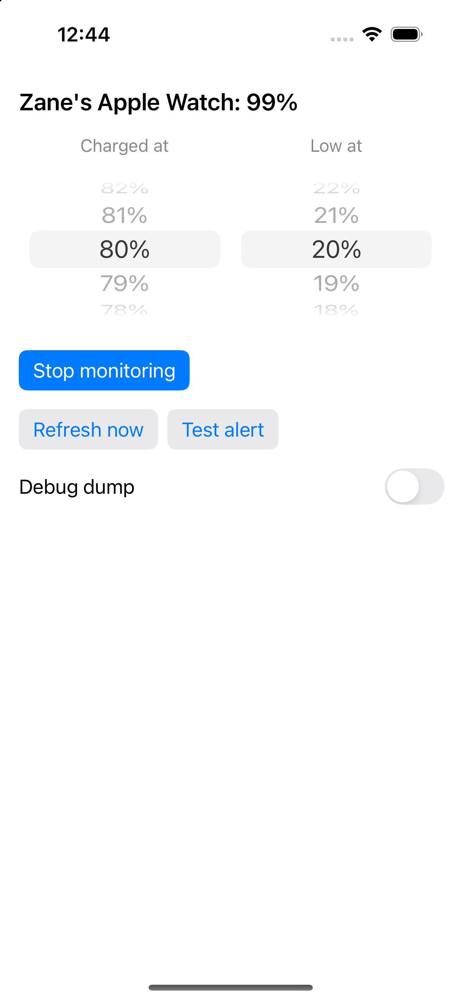

<p align="center">
  
</p>

<h1 align="center">Juiced</h1>

<p align="center">
  Get a notification on your iPhone when your Apple Watch finishes charging —
  and another when it's running low.
</p>

---

## What it does

iOS gives you no warning when your Apple Watch is charged. Juiced polls the paired
watch's battery and fires a local notification when it crosses a threshold:

- **Charged** — watch is on the charger and at/above your ceiling (default 80%): *"Zane's Apple Watch at 80% — grab it."*
- **Low** — watch is off the charger and at/below your floor (default 20%): *"Zane's Apple Watch at 20% — charge it soon."*

Both alerts are silent and time-sensitive. Each re-arms when the watch's charging
state flips, so you get one alert per charge cycle rather than a stream.

## Screenshots

| App | Charged alert | Low alert |
|---|---|---|
|  |  |  |

## How it works

The interesting part is getting the watch's battery level at all. **iOS has no public
API for a paired watch's battery.** `WKInterfaceDevice.batteryLevel` is watch-only, and
a watchOS app can't help because its background refresh is suspended while on the
charger — exactly the condition that matters.

The obvious private route is `BatteryCenter.framework`, which is what the system
Batteries widget uses. **It doesn't work from an unentitled app.** On current iOS the
class loads and `-init` succeeds, but there's no `+sharedInstance`, no observer
callback ever fires, and `connectedDevices` stays permanently empty:

```
=== BCBatteryDeviceController CLASS methods ===
  +_sharedPowerSourceController
=== instance methods ===
  -addBatteryDeviceObserver:queue:  -connectedDevices  -init
=== connectedDevices ===
  0 device(s)
```

**IOKit's power-source API does work**, unentitled, with no special provisioning:

```swift
IOPSCopyPowerSourcesByType(0)   // 0 = all sources, including accessories
```

It returns every accessory battery — watch, AirPods, AirPods case, each earbud —
as a plain dictionary:

```
Accessory Category  = Watch
Name                = Zane's Apple Watch
Current Capacity    = 99
Max Capacity        = 100
Is Charging         = 0
Power Source State  = Battery Power
Transport Type      = Bluetooth
```

Two details that cost real debugging time:

- `IOPSCopyPowerSourcesInfo` / `IOPSCopyPowerSourcesList` return **only the phone's
  internal battery**. It's specifically the *by-type* call that exposes accessories.
  It's easy to conclude "no accessory data available" from the first pair alone.
- Filter on `Accessory Category == "Watch"`, not on name. Your AirPods, their case,
  and each individual earbud all appear in the same list, and a name filter breaks
  the moment the watch is renamed.

Charging is read from `Is Charging` **or** `Power Source State == "AC Power"`; the
accessories don't always agree on which one they populate.

### Staying alive in the background

A 30-second `Timer` only keeps firing while backgrounded because the app holds a
silent looping audio session (`UIBackgroundModes: [audio]`). This is the dominant
battery cost — the IOKit read itself is negligible, so raising the poll interval
saves almost nothing. `BGAppRefreshTask` is the battery-friendly alternative, but iOS
decides when it runs, which defeats the "grab it now" purpose of the charged alert.

## Build & run

Requires [xcodegen](https://github.com/yonoma/xcodegen) (`brew install xcodegen`) and Xcode.

```bash
xcodegen generate
open Juiced.xcodeproj
```

Set `DEVELOPMENT_TEAM` in `project.yml` to your own team ID, then run on a device.
**It must be a physical iPhone with a paired watch** — the simulator has no accessory
power sources.

Settings live in `ChargeMonitor` (`threshold`, `floorLevel`, 30s poll interval) and
are adjustable in the UI.

## Notifications on the watch

iPhone notifications mirror to a paired watch automatically — enable Juiced under
**Watch app → Notifications → Mirror iPhone Alerts From**. Mirroring only happens when
the watch is on your wrist and unlocked and the phone is locked, so in practice the
**low** alert reaches your wrist and the **charged** alert doesn't: the watch is sitting
on a charger, off-wrist, and therefore ineligible.

## This cannot ship on the App Store

Two independent blockers, either one disqualifying:

1. **IOKit is not a public iOS framework.** `IOPowerSources` is public on macOS but
   absent from the iOS SDK, which is why it's reached via `dlopen`/`dlsym`. That's
   private API use (guideline 2.5.1).
2. **The silent-audio keepalive** declares the audio background mode without producing
   audio (guideline 2.5.4).

There's no entitlement to request for either, and TestFlight runs the same checks.

Nothing about it is device-specific, though — it's unentitled and needs no jailbreak,
so it runs on any iPhone you can sign for. Realistic distribution is ad-hoc/development
(up to 100 devices/year on a paid account) or sideloading via AltStore/SideStore.

Private API behavior shifts between iOS releases; the **Debug dump** toggle in the app
prints the raw power-source dictionaries, which is how you'd spot a change.

## License

MIT
